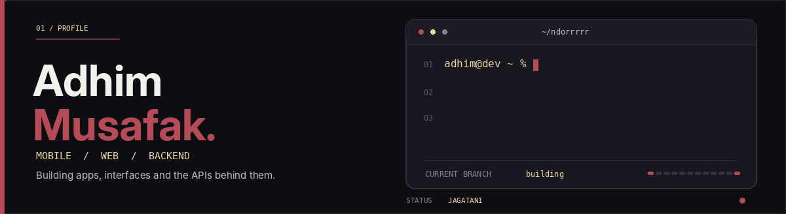

<div align="center">
  
</div>

<br>

### About

I work on web and mobile applications, from the interface to the API. Currently focused on **JagaTani** and its Flutter/backend integration.

```js
const focus = {
  web: ["React", "Node.js", "Express"],
  mobile: ["Flutter", "Dart"],
  backend: ["Python", "MySQL", "SQLite"],
  current: "JagaTani"
};
```

### Selected work

| Project | Description | Stack |
| :--- | :--- | :--- |
| **JagaTani** *(private)* | Mobile app for plant disease detection, treatment information, and agricultural stores. Backend and app integration in progress. | Flutter, Dart, Python, SQLite |
| [**UrbanMotion**](https://github.com/NDORRRRR/UrbanMotion) | Sneaker marketplace with a community forum and legit-check workflow. | React, Node.js, Express, MySQL |
| [**SakuMahasiswa**](https://github.com/NDORRRRR/SakuMahasiswa) | Java application project. | Java |

<details>
<summary><b>~/jagatani architecture</b></summary>
<br>

```text
JagaTani/
├── frontend/     Flutter + Dart
├── backend/      Python REST API
├── database/     SQLite
└── docs/         API, setup, architecture
```

The final AI model is being developed separately and will connect through an API.

</details>

<details>
<summary><b>~/languages by project</b></summary>
<br>

| Language | Project |
| :--- | :--- |
| JavaScript | UrbanMotion |
| Java | SakuMahasiswa |
| Dart, Python | JagaTani (private) |

*Based on selected projects, not a skill ranking or invented percentages.*

</details>

---

<sub>Gresik, Indonesia · [GitHub](https://github.com/NDORRRRR) · [Repositories](https://github.com/NDORRRRR?tab=repositories)</sub>
