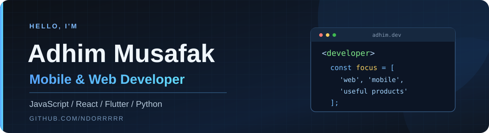

  

   

  
  

  
<b>Web applications · Mobile development · API integration</b>

  
I build practical projects and explore better ways to connect interfaces, services, and data.

## About me

- Building web interfaces and full-stack applications with **JavaScript, React, and Node.js**.
- Exploring **Flutter and Dart** for mobile apps, with **Python** for backend services.
- Interested in clean user experiences, maintainable code, and solving real project problems.

## Languages & tech stack

  
  
  
  
  
  
   
  
  
  
  
  
  

## GitHub overview

  <picture>
    <source srcset="https://github-readme-stats.vercel.app/api?username=NDORRRRR&show_icons=true&hide_rank=true&theme=github_dark&hide_border=true&bg_color=0D1117&title_color=58A6FF&text_color=C9D1D9&icon_color=58A6FF" />
    
  </picture>
  <picture>
    <source srcset="https://github-readme-stats.vercel.app/api/top-langs/?username=NDORRRRR&layout=compact&langs_count=8&size_weight=0.5&count_weight=0.5&theme=github_dark&hide_border=true&bg_color=0D1117&title_color=58A6FF&text_color=C9D1D9" />
    
  </picture>

Top Languages is generated from repository code, not a measure of proficiency. Public stats do not include private repository code by default.

## Selected projects

<table>
  <tr>
    <td width="33%" valign="top">
      <h3><a href="https://github.com/NDORRRRR/UrbanMotion">UrbanMotion</a></h3>
      Full-stack sneaker marketplace with a community forum and legit-check workflow.  
      <code>JavaScript</code> <code>React</code> <code>Node.js</code> <code>MySQL</code>
    </td>
    <td width="33%" valign="top">
      <h3><a href="https://github.com/NDORRRRR/thriftopia">thriftopia</a></h3>
      Responsive thrift-store front-end prototype with search, category filters, and dynamic product rendering.  
      <code>HTML</code> <code>CSS</code> <code>JavaScript</code> <code>Bootstrap</code>
    </td>
    <td width="33%" valign="top">
      <h3><a href="https://github.com/NDORRRRR/SakuMahasiswa">SakuMahasiswa</a></h3>
      A Java project from my public repositories.  
      <code>Java</code>
    </td>
  </tr>
</table>

  Thanks for visiting. Explore my public repositories to see the code and project details.

